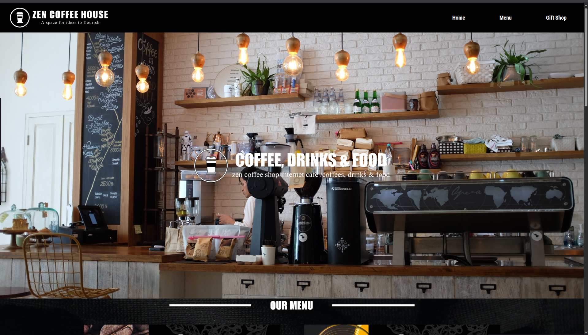
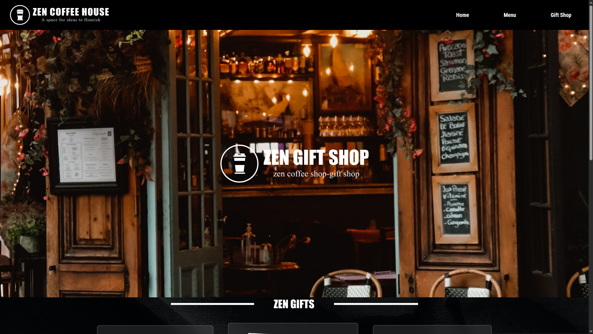

# ☕ Zen Coffee House

A modern, minimal, aesthetic web application for a premium coffee brand. This project bridges the gap between design and code, featuring a custom UI/UX identity translated into a responsive React application.

> **✨ Design & Development:** This project was end-to-end executed by me — from the initial Figma wireframes and UI/UX design to the final React implementation.

## 🚀 Overview

Zen Coffee House is designed to evoke a sense of calm and premium quality. The goal was to create a digital storefront that matches the atmosphere of a physical high-end café. It showcases a menu, brand story, and a seamless user interface.

**Check out the design preview on Instagram:** [Insta](https://www.instagram.com/reel/DS44KkCiRJQ/)

## ✨ Features

-   **Custom UI/UX Design:** Unique color palette, typography, and layout designed from scratch.
-   **Fully Responsive:** optimized for mobile, tablet, and desktop viewing.
-   **Modern Styling:** Built with **Tailwind CSS** for a clean, maintainable, and utility-first styling approach.
-   **Component-Based Architecture:** Modular React components for the hero section, menu, and testimonials.

## 🛠️ Tech Stack

-   **Design:** Figma / Adobe XD (UI/UX)
-   **Frontend:** React.js
-   **Styling:** Tailwind CSS
-   **Assets:** Custom imagery and iconography

## 📦 Getting Started

To view the coffee house locally:

1.  **Clone the repository**
    ```bash
    git clone [https://github.com/abhi-afk-dev/zen-coffee-house.git](https://github.com/abhi-afk-dev/zen-coffee-house.git)
    ```

2.  **Navigate to the project directory**
    ```bash
    cd frontend
    ```

3.  **Install dependencies**
    ```bash
    npm install
    ```

4.  **Run the application**
    ```bash
    npm run dev
    ```

## 📸 Screenshots







## 📄 License

This project is open source and available under the [MIT License](LICENSE).